<div align="center">


*First Place Winner at InnovateUNO Fall 2023* 🏆

</div>
 
# 🍏 About ScholarUp

ScholarUp is a **study companion** designed with students in mind. Born from the frustration of juggling multiple apps for studying, planning, and staying motivated, ScholarUp brings everything together in one beautifully cohesive experience.

### The Problem

Students today face:
- **App Fatigue** — Switching between Quizlet, Notion, Flora, and other apps
- **Lack of Motivation** — No rewards or visual progress tracking
- **Poor Organization** — Tasks scattered across different platforms
- **Burnout** — No built-in breaks or stress relief features

### The Solution

ScholarUp addresses these challenges by providing:
- **All-in-One Study Tools** — Flashcards, timers, and task management
- **Aesthetic Design** — A calming, zen-inspired color scheme
- **Gamification** — Track progress, earn stats, and stay motivated
- **Break Time Features** — Doodle during breaks to relieve stress

---

## 📗 Authentication 
 <div>
    
    
</div>

 ##  Flashcards
 ### Creating sets & cards
<div>
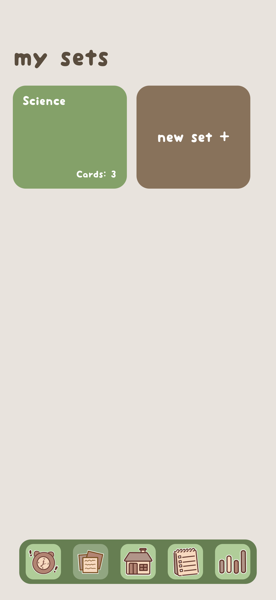
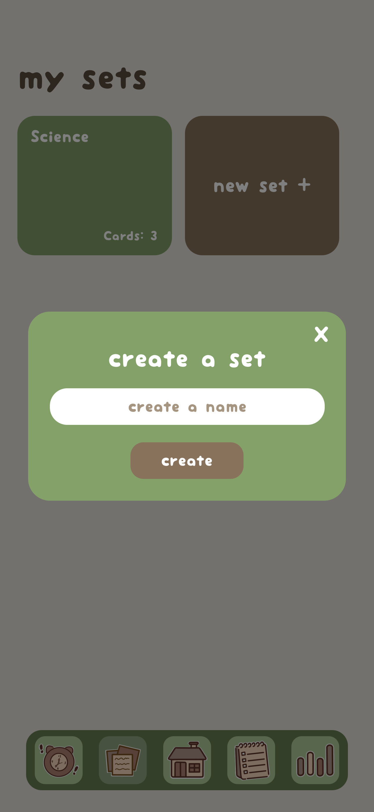

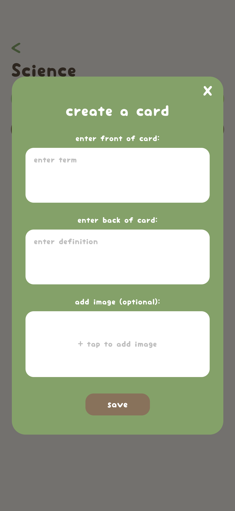
</div>

### Taking a quiz
<div>
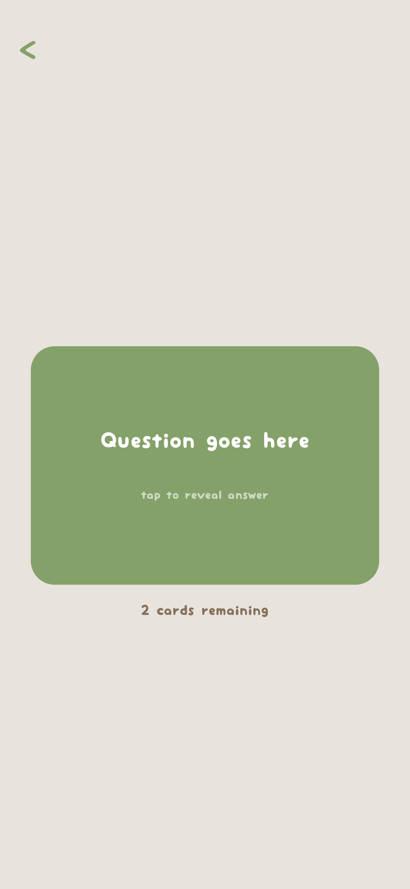
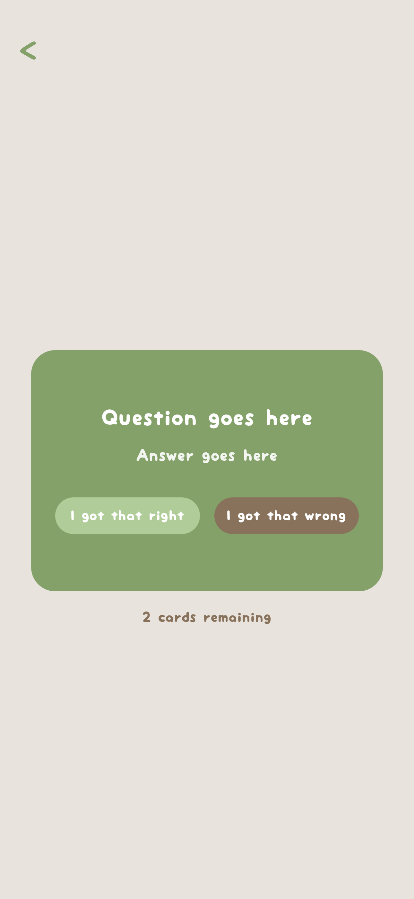
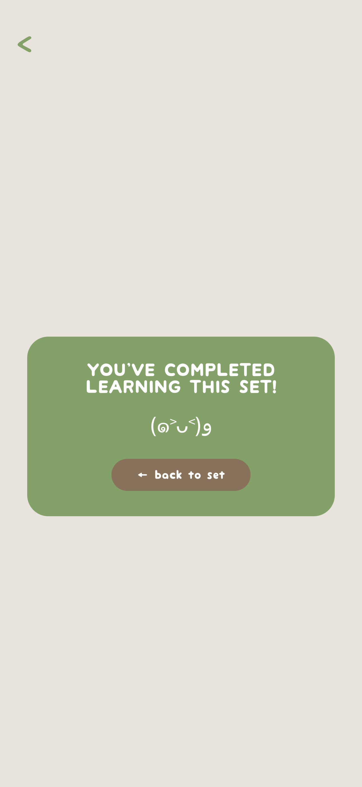
</div>

##  To-Do Lists 
### Creating lists & tasks 
<div>
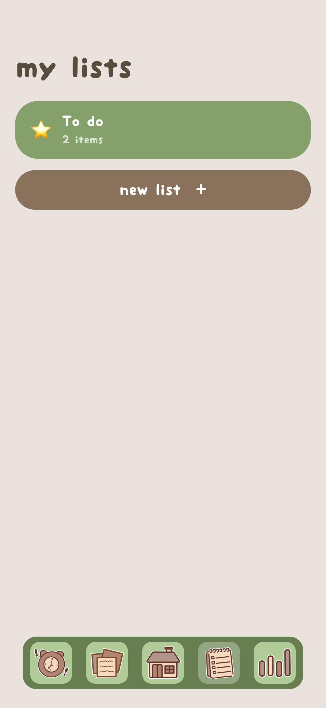

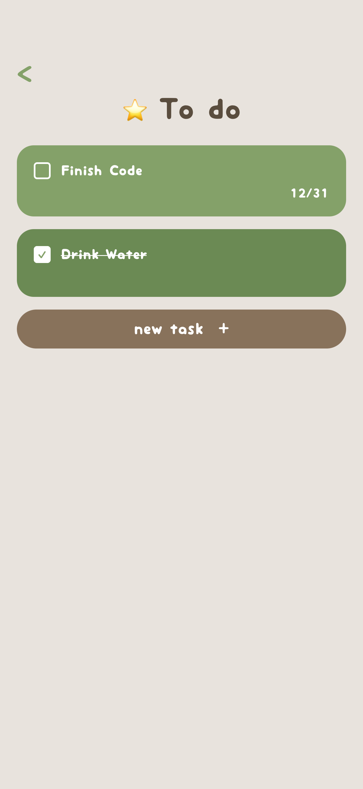
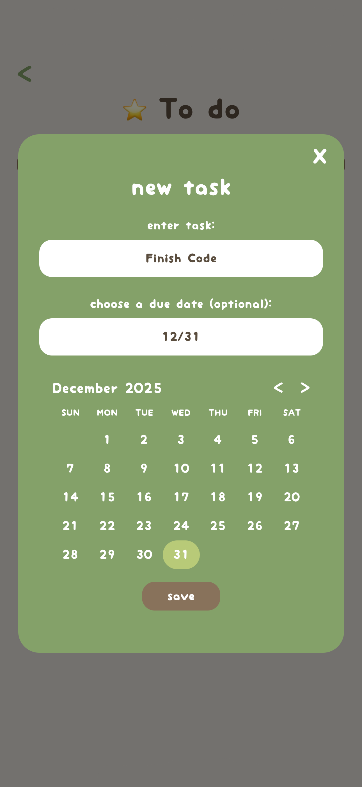
</div>

### Homescreen task display
<div>
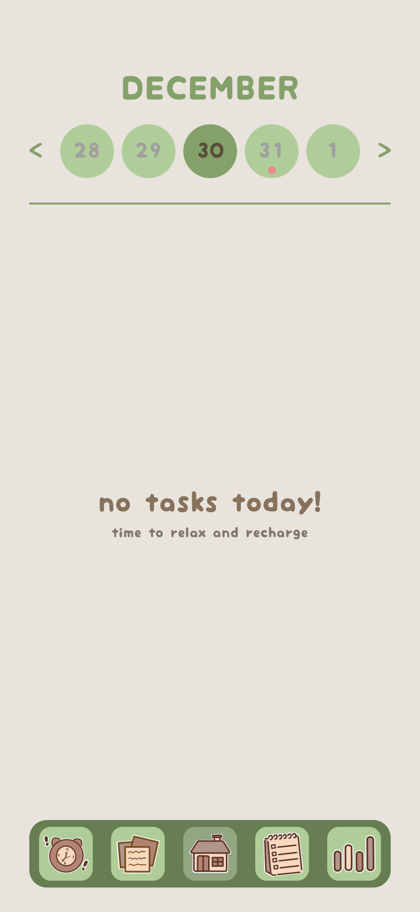
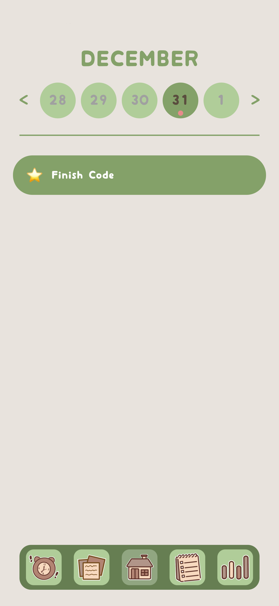
</div>

##  Study Timer 
### Default state & Focus
<div>
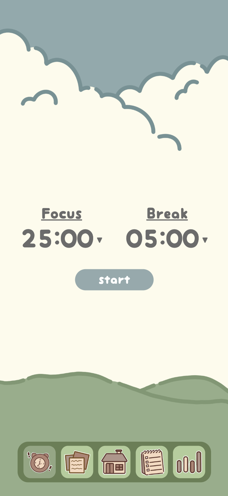
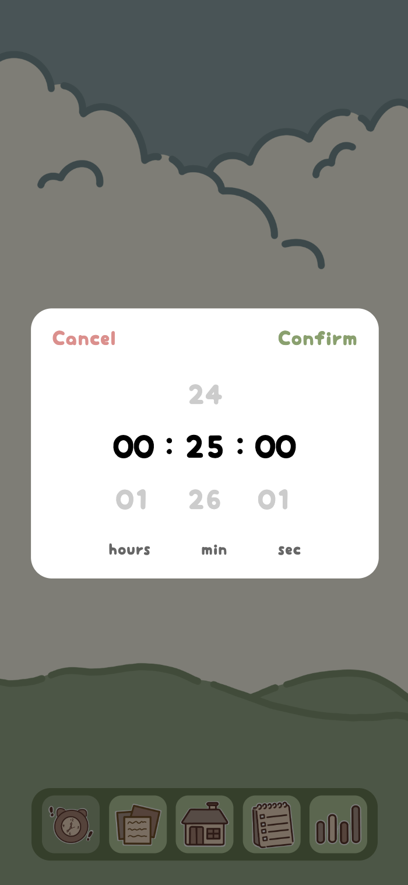

</div>

### Break & Draw
<div>
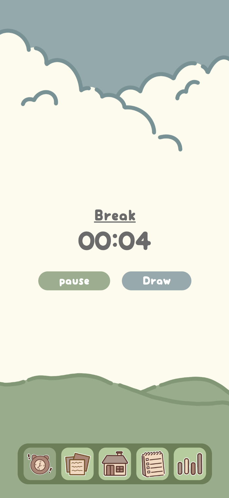
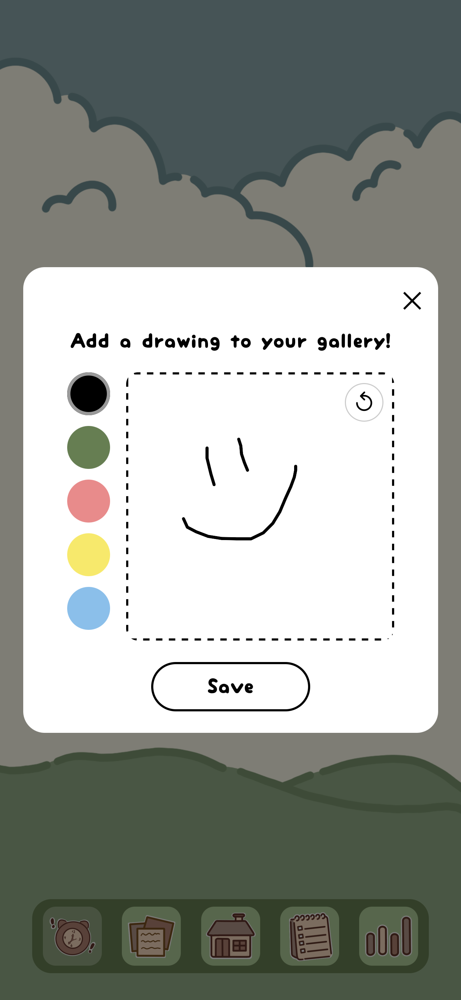
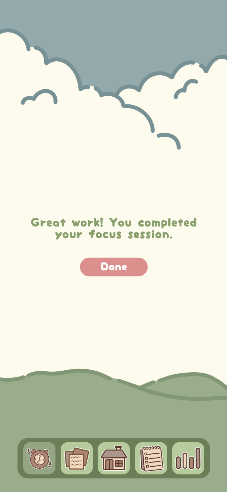
</div>
 
##  Statistics, Gallery, & Settings  
<div>
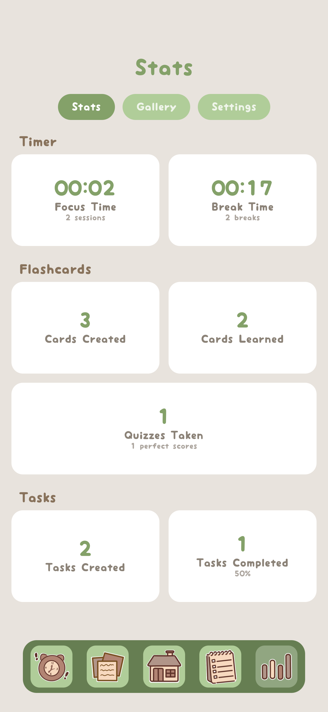
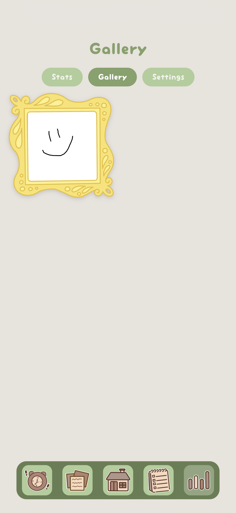
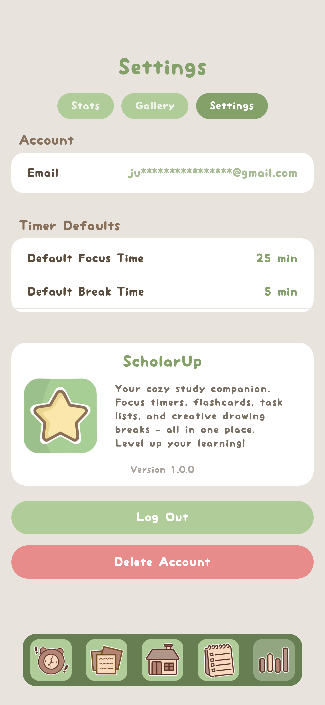
</div>
 
 ## App Icon


---

# 🍏 Case Study

This case study documents the development process, from initial problem analysis to the final deliverable, highlighting key milestones, stakeholder feedback, and iterative improvements.

## Problem Analysis

#### The Challenge
Students struggle with organization, motivation, and consistency in their study habits. Existing apps offer partial solutions but lack a unified approach.

#### Target Users (Stakeholders)

| User Type | Pain Points | What They Need |
|-----------|-------------|----------------|
| **Procrastinators** | Hard to start tasks | Streaks, reminders, accountability |
| **Overachievers** | Need motivation | Competition, achievements, stats |
| **Freshmen** | Disorganized | Simple onboarding, clear UI |
| **Non-Traditional** | Tech learning curve | Intuitive design, tutorials |
| **Burnt-Out Students** | Overwhelmed | Breaks, mindfulness |

#### Competitive Analysis

| App | Strengths | Weaknesses |
|-----|-----------|------------|
| **Notion** | Organization, flexibility | Steep learning curve, poor mobile UX |
| **Duolingo** | Gamification, addictive | Aggressive ads, punitive mistakes |
| **Quizlet** | Study modes, offline | Paywalled features, messy imports |
| **Flora** | Focus timer, gamified | Limited features, no flashcards |

#### Learned & Adopted

| From | Adopted | Improved |
|------|---------|----------|
| Duolingo | Gamification, stats tracking | Opt-out for non-competitive users |
| Notion | Organizational flexibility | More intuitive UI, easy onboarding |
| Flora | Focus timer with breaks | Added doodle feature for stress relief |
| Quizlet | Flashcard functionality | Cleaner UI, image support, free features |

## User Research

#### Key Insights from 7 Interviews

<div>


</div>

**Top Requested Features:**
1. Progress tracking and statistics
2. Pomodoro-style timer with breaks
3. Aesthetic, calming design
4. Integrated flashcards and tasks
5. Creative break activities

## Design Evolution

### Storyboard 


### Paper Prototype  


#### Testing Findings & Iterations

| Issue Found | Solution Implemented |
|-------------|---------------------|
| Unclear navigation icons | Changed icons to be more clear |
| Task visibility unclear | Improved calendar UI with date indicators |
| Back buttons too small | Made larger and more visible |
| Users doodle when bored | Added doodle feature during breaks |

#### Examples of doodles we saw at the library where the user tests took place: 


### Final Deliverable

The final app successfully merges planning, studying, and motivation into a single cohesive experience, addressing all key pain points identified during research.

---

## 🛠 Development & Architecture
[](https://reactnative.dev/)
[](https://expo.dev/)
[](https://www.typescriptlang.org/)
[](https://supabase.com/)

### Tech Stack

| Layer | Technology | Purpose |
|-------|------------|---------|
| **Frontend** | React Native 0.81.5 | Cross-platform mobile development |
| **Framework** | Expo 54.0 | Development tooling & builds |
| **Language** | TypeScript 5.9 | Type-safe JavaScript |
| **Backend** | Supabase | Database, Auth, Storage |
| **Navigation** | React Navigation 7 | Screen routing & tabs |
| **State** | React Context | Global state management |

### Project Structure

```
src/
├── assets/           # Images, fonts, icons
│   ├── fonts/
│   └── images/
├── components/       # Reusable UI components
├── constants/        # Colors, theme values
├── context/          # React Context providers
│   ├── AuthContext.tsx
│   ├── FlashCardsContext.tsx
│   ├── ListsContext.tsx
│   ├── StatsContext.tsx
│   └── TimerContext.tsx
├── hooks/            # Custom React hooks
├── lib/              # External service integrations
│   ├── supabase.ts
│   └── database.ts
├── screens/          # App screens
│   ├── HomeScreen.tsx
│   ├── FlashCardsScreen.tsx
│   ├── SetDetailScreen.tsx
│   ├── QuizScreen.tsx
│   ├── ListsScreen.tsx
│   ├── ListDetailScreen.tsx
│   ├── TimerScreen.tsx
│   ├── StatsScreen.tsx
│   ├── LoginScreen.tsx
│   └── SignUpScreen.tsx
├── services/         # Business logic
├── types/            # TypeScript definitions
└── utils/            # Helper functions
```

## Database Schema

### Entity Relationship Diagram


### Security Model

All tables implement **Row Level Security (RLS)**:

```sql
-- Example: Users can only access their own data
CREATE POLICY "Users can manage their own data"
ON table_name FOR ALL
USING (auth.uid() = user_id);
```

This ensures:
- Users can only read their own data
- Users can only modify their own data
- No cross-user data leakage
- Safe to use public API keys

---
## Roadmap & Future Updates

### Version 1.0.0 (Planned) - Feb. 2025 Release  
- [ ] one time $3.99 premium features payment model
- [ ] Timer sound alert
- [ ] Export Data (flashcards, stats)
- [x] Eraser in doodle pop up

### Version 1.2.0 (Planned)
- [ ] Flashcards & Lists search bar
- [ ] Recurring Tasks (daily, weekly, monthly)
- [ ] Spaced repetition algorithm for flashcards (anki method)
- [ ] Import flashcards from Quizlet

### Version 1.3.0 (Planned)
- [ ] Web Version

### Version 2.0.0 (Future)
- [ ] Pomodoro session enhancements (add tasks to your focus session)
- [ ] Push notifications for task reminders
- [ ] Widget support for home screen
- [ ] Study streak tracking
- [ ] Badges (100 flashcards learned, etc.)
- [ ] Color theme picker intead of a green color scheme

## Feature Requests
Have an idea? [Open an issue](https://github.com/JumanaCS/ScholarUp/issues) with the `enhancement` label!

---

## 🏆 Awards & Recognition

### InnovateUNO Fall 2023
ScholarUp was presented on November 14th, 2023 at UNO’s annual research symposium, _InnovateUNO_. 
<!-- See a [video of the presentation]()! -->
It placed **First Place** out of 100+ other UNO students and faculty, winning $200 and an invitation to present at the ULS Annual Academic Summit. 
- [Winners Page](https://www.uno.edu/innovateuno/winners#:~:text=Fall%202023-,Undergraduate,-Students)
- [Presentation Slides](https://docs.google.com/presentation/d/17w2G4pYsliUlZ8SEmiXdHXObV6MG3XdAndcf3I_jJzw/edit?usp=sharing)
   


### Handmade Charms Made for the Audience 


### ULS Academic Summit 2024 
ScholarUp was presented at Louisiana Tech University on April 11-12, 2024 for the University of Louisiana System Academic Summit. The summit included students and faculty from all nine ULS universities.


---

# 📜 Version History

| Version | Date | Highlights |
|---------|------|------------|
| **BETA** | Dec 2025 | Initial public release |
| | | Flashcards with images & quiz mode |
| | | To-do lists with due dates |
| | | Focus timer with doodle breaks |
| | | Statistics dashboard |
| | | User authentication |
| | | Cloud sync with Supabase |


---

<div align="center">

**Made with 💚 by Jumana Suleiman**

*ScholarUp - LevelUp Your Learning*

</div>
