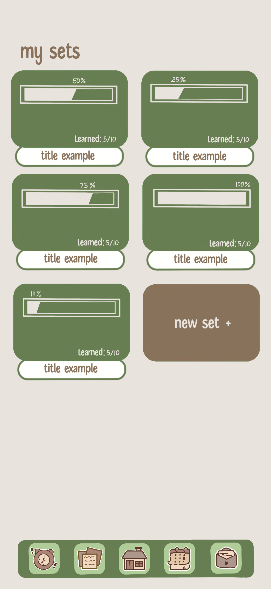
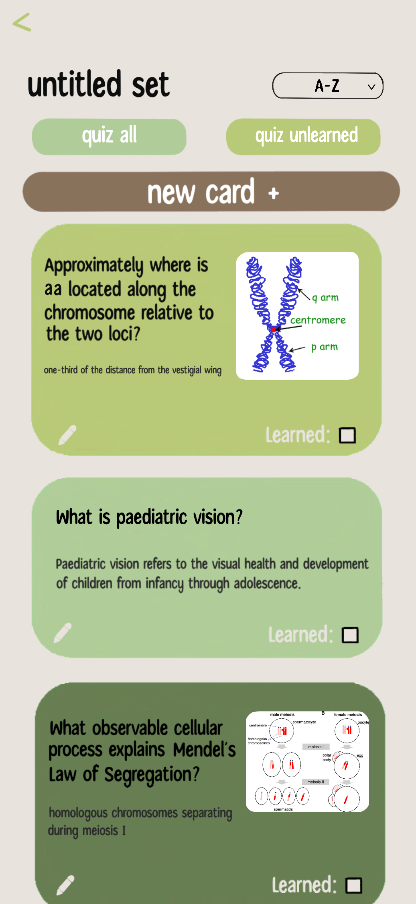
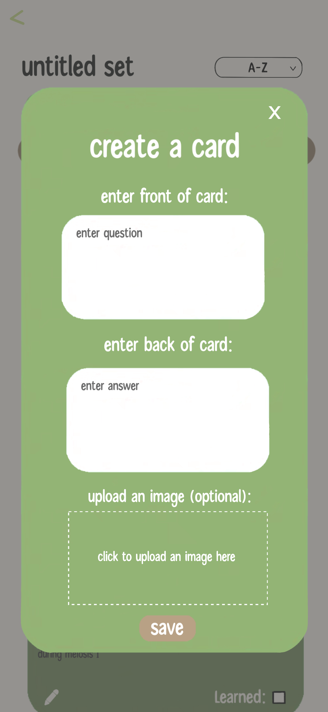
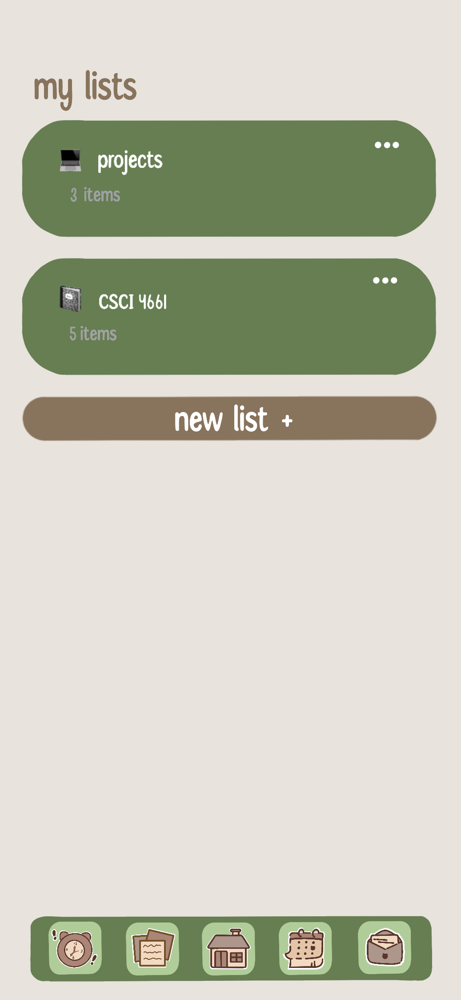
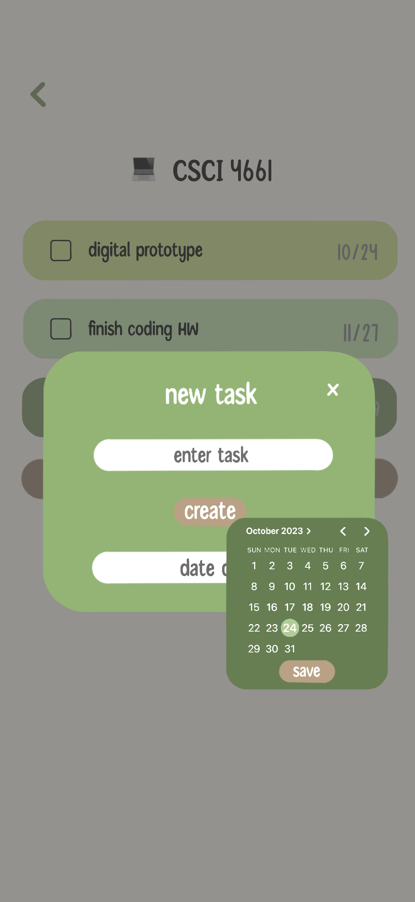

# :green_apple: About ScholarUp 
ScholarUp is our study app created for our Mobile Applications Development course in Fall 2023; presented at InnovateUNO (2023) and the Annual ULS Academic Summit (2024).

ScholarUp is a combination of studying, planning, and _friendly_ competition. ScholarUp uses XP from creating flashcards, studying, or mastering a concept to determine where a user would fall on a leaderboard. We implement daily challenges and achievements for those who enjoy the passive challenge.

## 📗 Features
• Flashcards  
• To Do Lists  
• Study Timer  

# 📦 Screenshots 
 

    
    

 <be> 

## :trophy: InnovateUNO 
ScholarUp was presented on November 14th, 2023 at UNO’s annual research symposium, _InnovateUNO_. See our [abstract](https://www.uno.edu/innovateuno/abstracts#comp).
<!-- See a [video of the presentation]()! -->
It placed **First Place** out of 100 other UNO students and faculty, winning $200 and an invitation to present at the ULS Annual Academic Summit.

## :microphone: ULS Academic Summit 2024
ScholarUp was presented at Louisiana Tech University on April 11-12, 2024 for the University of Louisiana System Academic Summit. The summit included students and faculty from all nine ULS universities.
